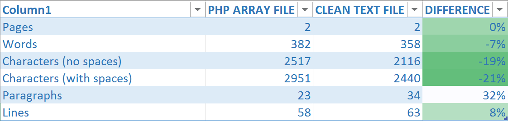
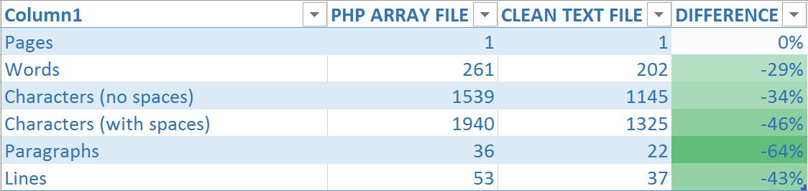

# Translate This

*Exports Laravel localization files to plain text files ready for translation.*

**Character optimization from 21% to 46%** Saves you money when sending translations to be translated.

## Features

- Strips HTML & PHP tags
- Trims strings left and right
- Replaces multiples blank spaces with single space
- Exported txt file can be opened with MS Word or Notepad

## Instructions on how to use

Install globally with:

```
composer global require mabasic/translatethis
```

Then you can use it on any Laravel project you want, like so:

```
translatethis export:txt source destination

translatethis export:txt C:\\repositories\\murterin\\app\\lang\\hr C:\\Users\\Mario\\Downloads
```

## Benefits

### Mostly text

If your text contains a lot of html formatting, this will help reduce the character count a lot.



### Mostly brackets

This is where you will see the most benefit. Deeply nested arrays have a higher character count.

